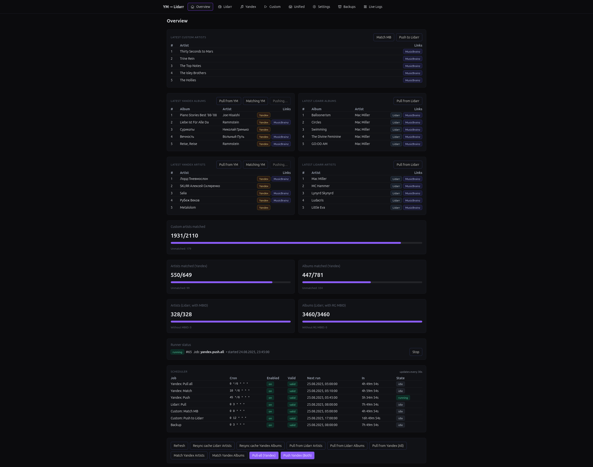
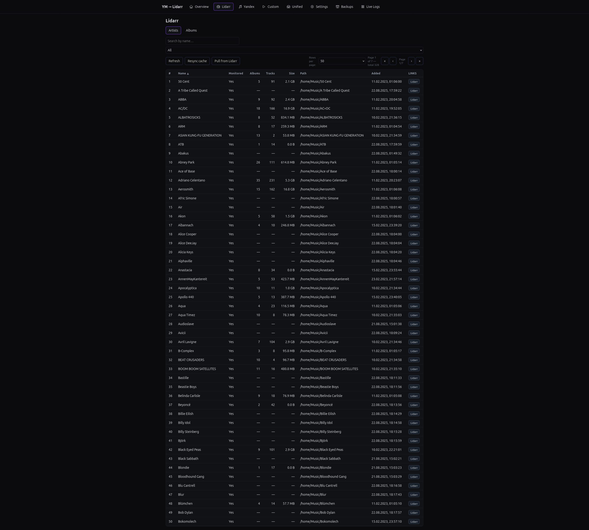
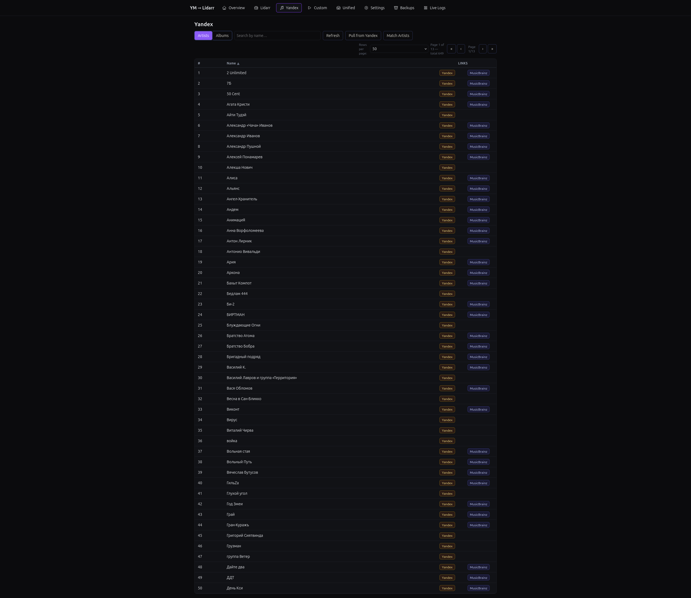
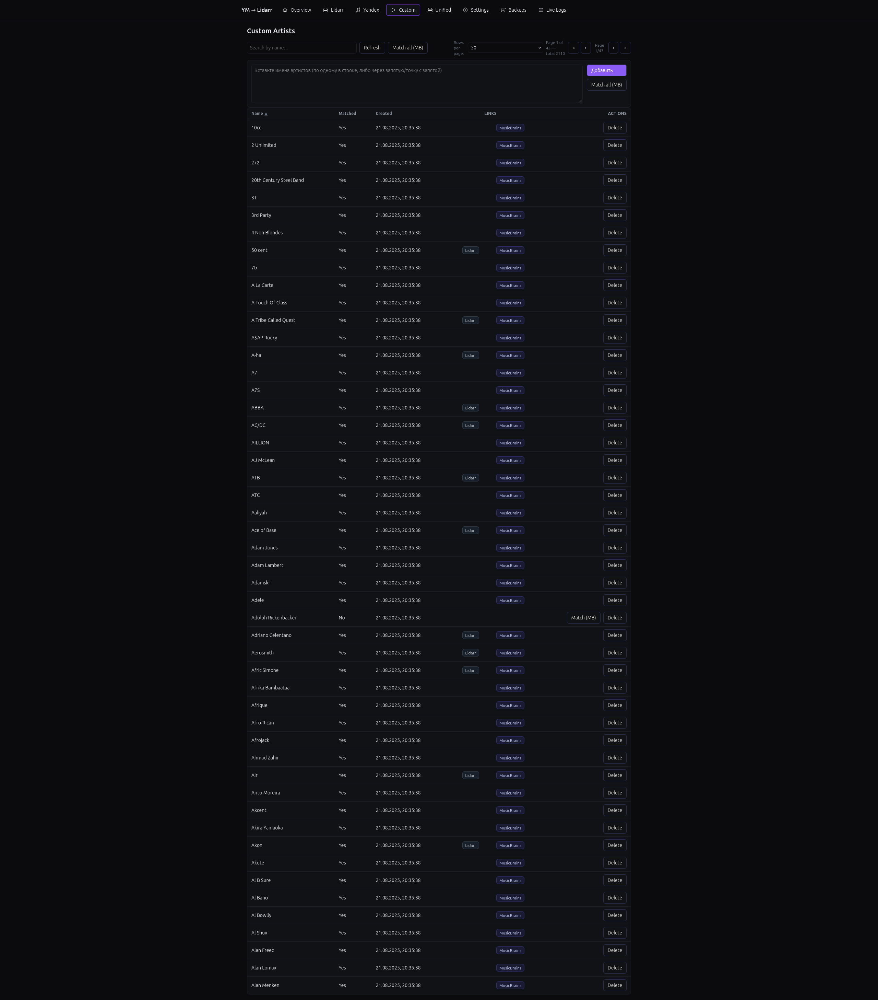
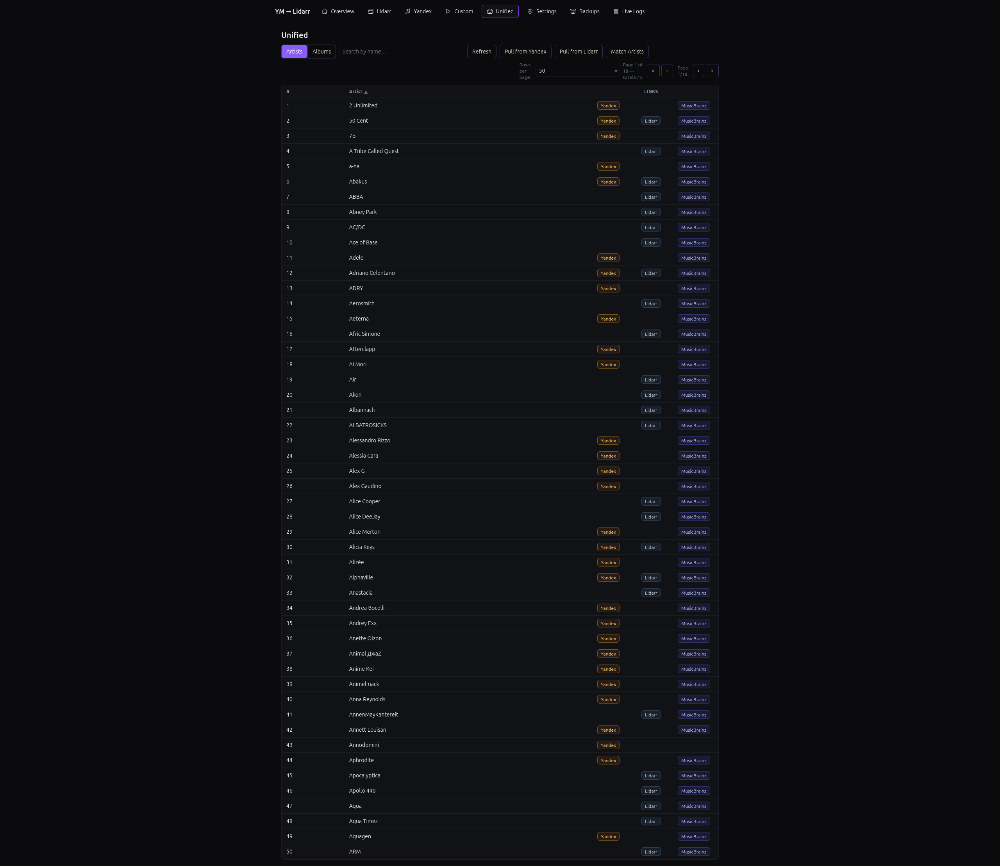
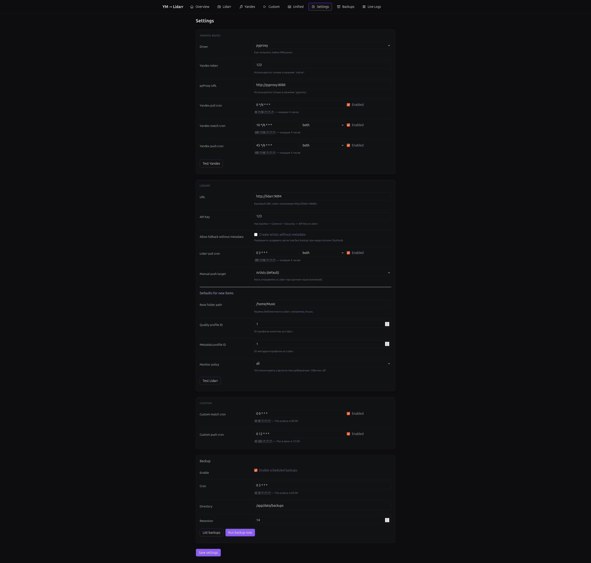
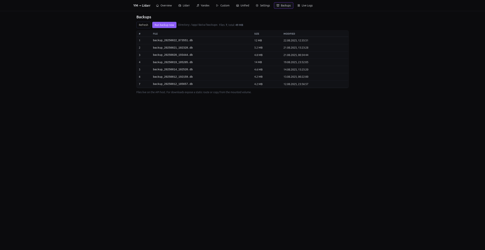
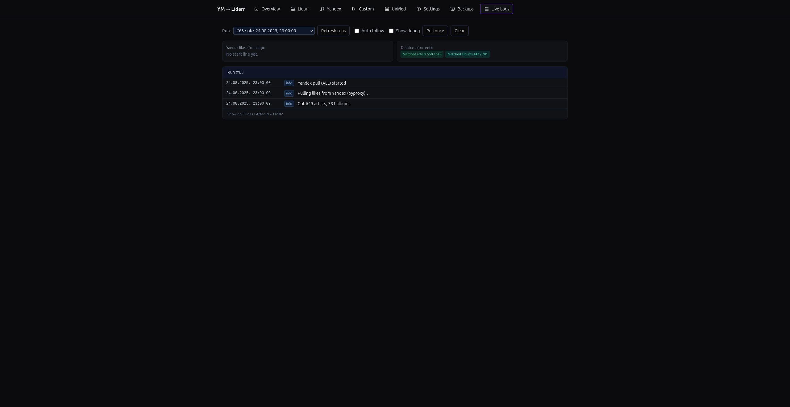

**YM → Lidarr**

[](https://bestpractices.coreinfrastructure.org/projects/11085)
[](https://securityscorecards.dev/viewer/?uri=github.com/MrSaerus/ym2lidarr)
[](https://github.com/MrSaerus/ym2lidarr/releases)
[](https://github.com/MrSaerus/ym2lidarr/actions/workflows/release.yml)
[](https://github.com/MrSaerus/ym2lidarr/actions/workflows/tests-unit.yml)

## Docker
[](https://hub.docker.com/r/saerus/ym2lidarr-api/)
[](https://hub.docker.com/r/saerus/ym2lidarr-web/)
[](https://hub.docker.com/r/saerus/ym2lidarr-pyproxy/)
[](https://hub.docker.com/r/saerus/ym2lidarr-single/)

## Описание
Сервис, забирает **лайки из Яндекс.Музыки** и отправляет их в **Lidarr** (кастом-лист артистов или релиз-группы альбомов).

## Screenshots

1. Main

2. Lidarr

3. Yandex

4. Custom

5. Unified

6. Settings

7. Backup

8. Logs


🚀 **Возможности**

- Сбор лайкнутых **треков/альбомов** из Яндекс.Музыки.
- Матчинг с **MusicBrainz** (артисты → MBID, альбомы → release-group MBID).
- **Push в Lidarr**: артисты (по умолчанию) или альбомы.
- Экспорт **JSON/CSV/MD** (прямо из БД, без файлов-кусков).
- Вкладки **Found / Unmatched** с кандидатами и ссылками на MB/Yandex Music.
- **Live Logs** — онлайновый просмотр логов текущего/последнего прогона.
- **Настройки во фронте**: токены/ключи, режимы, расписания, частоты.
- **Планировщик** (cron) для Яндекс-синка, Лидарр-пуша и бэкапов (вкл/выкл).
- **Бэкапы SQLite** (VACUUM INTO) с ротацией.
- **Нотификации** о завершении синка: Telegram или Webhook.
- **Health-checks** для всех компонентов (web/api/pyproxy).
- Всё хранится в **SQLite** (настройки, кэши, кандидаты, логи, результаты).


🧩 **Архитектура**

```
Next.js (web, 3000)  ──>  Node.js API (4000)  ──>  SQLite (Prisma)
```

- **web** — Next.js 14, UI и настройка.
- **api** — Express + Prisma, вся логика, cron, экспорт, нотификации.
- **pyproxy** — FastAPI, безопасная работа с ЯМ (обходит SmartCaptcha).

📦 **Быстрый старт (Docker)**
Требуется Docker и docker compose v2.

```bash

# 1) склонировать
git clone <repo>
cd <repo>

# 2) (опционально) задать переменные окружения в .env
cp .env.example .env

# 3) собрать и запустить
docker compose up -d --build

# web: http://localhost:3000
# api: http://localhost:4000/health
# pyproxy: http://localhost:8080/health
```

**Пример** `docker-compose.yml`

```yaml
services:
  api:
    build:
      context: .
      dockerfile: docker/api.Dockerfile
    environment:
      - NODE_ENV=production
      - DATABASE_URL=file:/app/data/app.db
      - YA_PYPROXY_URL=http://pyproxy:8080
      - MB_RECHECK_HOURS=168
    ports:
      - '4000:4000'
    volumes:
      - db:/app/data
    healthcheck:
      test: ['CMD-SHELL', 'curl -fsS http://localhost:4000/health || exit 1']
      interval: 30s
      timeout: 5s
      retries: 3
    depends_on:
      - pyproxy

  web:
    build:
      context: .
      dockerfile: docker/web.Dockerfile
    environment:
      - NEXT_PUBLIC_API_BASE=http://localhost:4000
      - NODE_ENV=production
    ports:
      - '3000:3000'
    healthcheck:
      test: ['CMD-SHELL', 'curl -fsS http://localhost:3000/health || exit 1']
      interval: 30s
      timeout: 5s
      retries: 3
    depends_on:
      - api

  pyproxy:
    build:
      context: apps/pyproxy
      dockerfile: Dockerfile
    ports:
      - '8080:8080'
    healthcheck:
      test: ['CMD-SHELL', 'curl -fsS http://localhost:8080/health || exit 1']
      interval: 30s
      timeout: 5s
      retries: 3

volumes:
  db:
```

🧑‍💻 **Локальная разработка**

Требуется Node.js ≥ 18.17 (рекомендуется 20.x) и npm.

```bash
npm i

# prisma
export DATABASE_URL="file:./data/app.db"
npx prisma generate
npx prisma migrate dev --name init

# dev-серверы (в разных терминалах):
npm run dev:api   # http://localhost:4000
npm run dev:web   # http://localhost:3000

# pyproxy (python >= 3.10)
cd apps/pyproxy
pip install -r requirements.txt
uvicorn main:app --host 0.0.0.0 --port 8080
```

В проде/в докере Prisma использует путь file:/app/data/app.db.

⚙️ **Настройки (во фронте)**
**Yandex Music**

- Driver: pyproxy (по умолчанию) или native. Рекомендуется pyproxy.
- PyProxy URL: например, http://pyproxy:8080.
- Yandex token: OAuth токен ЯМ.
- Sync cron (Yandex): CRON-выражение или пусто (отключено).

**Lidarr**

- Push target: artists (по умолчанию) или albums (release-groups).
- Lidarr URL: http://lidarr:8686
- Lidarr API key: ключ API.
- Sync cron (Lidarr push): CRON или пусто (отключено).

**Backups (SQLite)**

- Enabled: вкл/выкл.
- Cron: расписание бэкапа.
- Retention (files): сколько файлов держать.
- Directory: каталог бэкапов (по умолчанию /app/data/backups).
- Бэкап делает атомный снапшот через VACUUM INTO.

**Notifications**

- Type: none / telegram / webhook.
- Telegram:
  - Telegram Bot Token
  - Telegram Chat ID
- Webhook:
  - Webhook URL
  - Webhook Secret (опционально, для подписи HMAC-SHA256 в заголовке X-Signature).

🖥️ **Интерфейс**
**Overview** — общая статистика, запуск синка/пуша.
**Found** — сматченные артисты/альбомы (ссылки на MB и YM).
**Unmatched** — не сматченные, кандидаты c подсветкой, ссылки на MB/YM.
**Live Logs** — логи текущего/последнего запуска, онлайн-обновление.
**Settings** — все настройки, тесты коннектов, запуск бэкапа, ссылки на экспорт.

🔁 **Как это работает**

1. Сбор лайков у ЯМ через pyproxy (или native).
2. Из треков собираем артистов и альбомы (уникально).
3. Матчинг с MusicBrainz c кэшем и ограничением частоты запросов.
4. Сохранение результатов/кандидатов/кэша в SQLite.
5. Пуш в Lidarr (артисты/альбомы — настраивается).
6. Live-логирование в БД, нотификации о результате.

**Cool-down рематчинга**
Повторный матчинг пропускается в течение MB_RECHECK_HOURS (по умолчанию 168 часов / 7 дней).
Можно принудительно запустить Run (force) — игнорирует cool-down.

# 🔗 **API**

Все эндпоинты работают под `/api/*`, кроме блока **Runs**, где доступно и без префикса.

---

## Health

- **GET `/api/health`** — проверка живости `{ ok: true }`.

---

## Settings

- **GET `/api/settings`** — получить настройки.
- **GET `/api/settings/scheduler`** — статус cron-джоб.
- **POST `/api/settings`** — сохранить настройки.
- **PUT `/api/settings`** — то же, что `POST`.

### Тесты

- **POST `/api/settings/test/yandex`** — проверить токен Yandex.
- **POST `/api/settings/test/lidarr`** — проверить Lidarr API, подтянуть дефолты.
- **POST `/api/settings/lidarr/defaults`** — подтянуть дефолты Lidarr (с опцией overwrite).

---

## Stats

- **GET `/api/stats`** — сводка по Yandex, Lidarr и Custom, последние элементы, активные/последние прогоны.

---

## Export

- **GET `/api/export/artists.json`** — артисты в JSON (MBID).
- **GET `/api/export/albums.json`** — альбомы в JSON (ReleaseGroupMBID).
- **GET `/api/export/artists.csv`**, **GET `/api/export/albums.csv`** — CSV для Excel.
- **GET `/api/export/artists.md`**, **GET `/api/export/albums.md`** — Markdown таблицы.

---

## Backup

- **GET `/api/backup/list`** — список бэкапов.
- **POST `/api/backup/run`** — выполнить бэкап сейчас.

---

## Unified (объединённые списки)

- **GET `/api/unified/artists`** — артисты Yandex+Lidarr с MB/Lidarr/Yandex ссылками.
- **GET `/api/unified/albums`** — альбомы Yandex+Lidarr с MB/Lidarr/Yandex ссылками.

---

## Yandex

### Ручные старты

- **POST `/api/yandex/pull-all`** — загрузить лайки в кэш.
- **POST `/api/yandex/match`** `{ target, force? }` — матчинг к MB.
- **POST `/api/yandex/push`** `{ target }` — отправка в Lidarr.

### Списки

- **GET `/api/yandex/artists`** — артисты из кэша Yandex.
- **GET `/api/yandex/albums`** — альбомы из кэша Yandex.

---

## Lidarr

### Artists

- **GET `/api/lidarr/artists`** — артисты из кэша Lidarr.
- **POST `/api/lidarr/artist/:id/refresh`** — обновить кэш артиста.

### Albums

- **GET `/api/lidarr/albums`** — альбомы из кэша Lidarr.
- **POST `/api/lidarr/album/:id/refresh`** — обновить кэш альбома.
- **POST `/api/lidarr/resync`** — полный ресинк артистов и альбомов.

---

## Custom Artists

- **GET `/api/custom-artists`** — список кастомных артистов.
- **POST `/api/custom-artists`** `{ names: string[] }` — добавить артистов.
- **PATCH `/api/custom-artists/:id`** — обновить имя или MBID.
- **DELETE `/api/custom-artists/:id`** — удалить артиста.

### Матчинг

- **POST `/api/custom-artists/:id/match`** — матчинг одного артиста.
- **POST `/api/custom-artists/match-all`** — матчинг всех.

---

## Sync (совместимостьные ручные старты)

- **POST `/api/sync/yandex/pull`** — Yandex Pull.
- **POST `/api/sync/lidarr/pull`** — Lidarr Pull.
- **POST `/api/sync/match`** — матчинг.
- **POST `/api/sync/lidarr`** — пуш в Lidarr.
- **POST `/api/sync/custom/match`** — матчинг custom артистов.
- **POST `/api/sync/custom/push`** — пуш custom артистов в Lidarr.
- **POST `/api/sync/yandex/pull-all`** — полный Pull.
- **POST `/api/sync/yandex/match`** — матчинг Yandex.
- **POST `/api/sync/yandex/push`** — пуш Yandex.

### Runs внутри `/sync`

- **GET `/api/sync/runs`** — последние прогоны.
- **GET `/api/sync/runs/:id`** — детали.
- **GET `/api/sync/runs/:id/logs`** — логи.
- **POST `/api/sync/runs/:id/stop`** — мягкая остановка.

---

## Runs & Logs (совместимость; дублируется с `/api`)

- **GET `/runs?limit=…`** — список запусков.
- **GET `/runs/latest`** — последний запуск.
- **GET `/runs/:id`** — детали запуска.
- **GET `/runs/:id/logs`** — логи запуска.
- **POST `/runs/:id/stop`** — мягкая остановка.

> 🔒 Для UI стабильные пути:
> - `GET /api/runs?limit=30`
> - `GET /api/runs/:id/logs`
> - `GET /api/stats`


🔐 **Переменные окружения**
| Переменная              | Назначение                                                     | Пример                                   |
|--------------------------|----------------------------------------------------------------|------------------------------------------|
| **PORT_API**             | Порт для запуска API                                          | `PORT_API=4000`                          |
| **YA_PYPROXY_URL**       | URL PyProxy-сервиса для проксирования запросов к Я.Музыке     | `YA_PYPROXY_URL=http://pyproxy:8081`     |
| **YANDEX_MUSIC_TOKEN**   | Основной токен доступа для Яндекс.Музыки                      | `YANDEX_MUSIC_TOKEN=Y0_AgAAA...`         |
| **YM_TOKEN**             | Альтернативное имя токена Яндекс.Музыки                       | `YM_TOKEN=Y0_AgAAA...`                   |
| **MB_RECHECK_HOURS**     | Кол-во часов для перепроверки сопоставлений MusicBrainz       | `MB_RECHECK_HOURS=168`                   |
| **YA_UA**                | Кастомный User-Agent для запросов к Яндекс.Музыке             | `YA_UA=MyApp/1.0 (Linux; x86_64)`        |
| **YA_CLIENT**            | Идентификатор клиента Яндекс.Музыки                           | `YA_CLIENT=Android/240213`               |
| **NEXT_PUBLIC_API_BASE** | Базовый URL API для фронтенда (Next.js, доступно в браузере)  | `NEXT_PUBLIC_API_BASE=https://host/api`  |


`Большинство настроек можно задать уже во фронте (Settings) — они сохраняются в SQLite.`

🧪 **Нотификации**

**Telegram**: сообщение о завершении синка (ok/error) с краткой статистикой.

**Webhook**: POST JSON вида:

```json
{
  "source": "yandex",
  "status": "ok",
  "runId": 123,
  "stats": { "...": "..." }
}
```

Если задан `webhookSecret`, добавляем заголовок `X-Signature: sha256=<HMAC>`.

🧰 **Траблшутинг**

- **403 SmartCaptcha от Яндекса**

      Используйте драйвер pyproxy (рекомендовано) и белый IP (не DC/VPN).

  В native возможны блоки со стороны ЯМ.

- **Next.js ругается на Node**

  Нужен Node ≥ 18.17 (лучше 20.x).

- **Prisma/SQLite/openssl в alpine-образах**

  Мы используем Debian-based образы. Если собираете своё — ставьте совместимый OpenSSL.

- **Пустые списки Found/Unmatched**

  Проверить, что синк прошёл (Overview → Run) и что фронт стучится в правильные роуты /api/found и /api/unmatched.

🤝 **Contributing**

**PR приветствуются**: багфиксы, улучшения UI, новые драйверы, доп. форматы экспорта.
**Перед PR**: `npm i`, `npx prisma generate`, линт, сборка web/api, быстрый прогон в docker compose.

🗺️ **Roadmap**

- Выборочное добавление кандидатов вручную (assign MBID/RG).
- Пакетные исправления/объединение дублей.
- Синх художников/альбомов из Lidarr обратно в ЯМ (идея).
- SSE/WebSocket для live-логов (вместо polling).
- Роли/доступы (если потребуется).
- поиск/фильтр по логам (artist/album/level),
- экспорт текущего лога (NDJSON/CSV),
- автосворачивание debug и переключатель “compact/verbose”,
- ретеншн для старых runs (очистка по количеству/возрасту),
- опционально: добавлю в “Artist skip” название трека — для этого расширю сбор лайков Я.Музыки до треков и буду логировать data.song.
- Онлайн обновление текущей статистики из базе на главной и в логах
- Добавить фоновую сверку с самим Лидаром (например, если в кеше пусто, но в Лидар добавили вручную)