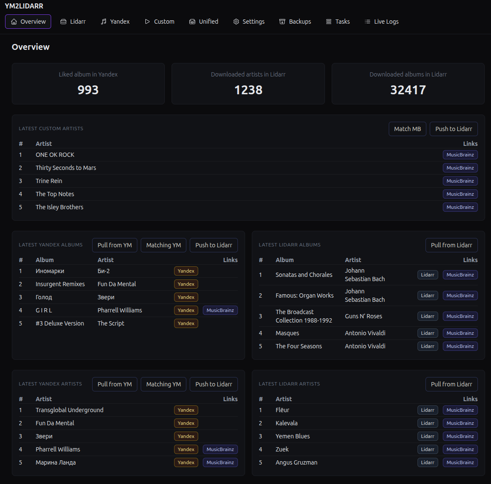

**YM2LIDARR**

[](https://bestpractices.coreinfrastructure.org/projects/11085)
[](https://securityscorecards.dev/viewer/?uri=github.com/MrSaerus/ym2lidarr)
[](https://github.com/MrSaerus/ym2lidarr/releases)
[](https://github.com/MrSaerus/ym2lidarr/actions/workflows/release.yml)
[](https://github.com/MrSaerus/ym2lidarr/actions/workflows/tests-unit.yml)

## Docker
[](https://hub.docker.com/r/saerus/ym2lidarr-api/)
[](https://hub.docker.com/r/saerus/ym2lidarr-web/)
[](https://hub.docker.com/r/saerus/ym2lidarr-pyproxy/)
[](https://hub.docker.com/r/saerus/ym2lidarr-single/)

## Описание:
Сервис YM2Lidarr автоматизирует наполнение и сопровождение музыкальной библиотеки, связывая Yandex Music, Lidarr и загрузку через торрент-пайплайн.

## Ключевые возможности:

* Синхронизация каталога: загрузка списков артистов и альбомов из Yandex Music в Lidarr.
* Хранение локального кэша и актуализация данных по расписанию.
* Сопоставление сущностей между Yandex и Lidarr.
* Отправка подобранных артистов и альбомов в Lidarr. 
* Синхронизация лайков из Yandex Music в Navidrome.
* beta Создание задач для артистов и альбомов для поиск релизов через Jackett/torznab, выбор релиза, добавление в qBittorrent, обновление статусов, копирование скачанного.
* beta Нарезка скачанных альбомов через CUE.




## Архитектура

- **web** — Next.js 14, UI и настройка.
- **api** — Express + Prisma, вся логика, cron, экспорт, нотификации.
- **pyproxy** — FastAPI, безопасная работа с ЯМ (обходит SmartCaptcha).

## Интерфейс
- **Overview** — общая статистика, запуск синка/пуша.
- **Found** — сматченные артисты/альбомы (ссылки на MB и YM).
- **Unmatched** — не сматченные, кандидаты c подсветкой, ссылки на MB/YM.
- **Live Logs** — логи текущего/последнего запуска, онлайн-обновление.
- **Settings** — все настройки, тесты коннектов, запуск бэкапа, ссылки на экспорт.

## Подробная документация

[Оглавление документации](DOC/index.md)

## Быстрый старт (Docker)
Требуется Docker и docker compose v2.

```bash

# Склонировать
git clone https://github.com/MrSaerus/ym2lidarr.git
cd ym2lidarr

# Есть 4 врианта запуска

# 1.Сборка и запуск 3 микросервисов
docker compose -f docker-compose.build.yml build && \
docker compose -f docker-compose.build.yml up -d

# 2. Запуск уже собранных образов
docker compose up -d

# 3.Сборка и запуск 3 микросервисов в одном контейнере
docker compose -f docker-compose.build.single.yml build && \
docker compose -f docker-compose.build.single.yml up -d

# 4.Запуск уже собранного образа
docker compose -f docker-compose.single.yml -d


# web: http://localhost:3000
# api: http://localhost:4000/health
# pyproxy: http://localhost:8080/health
```


Основные переменные прописаны в docker-compose, а все остальные задаются в разделе настроек


## Contributing

- **PR приветствуются**: багфиксы, улучшения UI, новые драйверы, доп. форматы экспорта.
- **Перед PR**: `npm i`, `npx prisma generate`, линт, сборка web/api, быстрый прогон в docker compose.